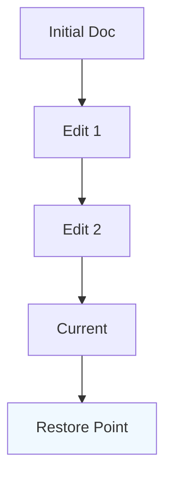

## Overview

DAB Worx provides essential tools for managing your project documentation. You create, edit, track changes, and collaborate seamlessly. These core features help teams maintain up-to-date docs without complexity.

<Columns cols={3}>
  <Card title="Document Creation" icon="edit-3" href="#document-creation">
    Build rich documents with markdown and components.
  </Card>
  <Card title="Version Control" icon="git-branch" href="#version-control">
    Track every change with full history and diffs.
  </Card>
  <Card title="Collaboration" icon="users" href="#collaboration">
    Share securely and work together in real-time.
  </Card>
</Columns>

## Document Creation and Editing

Start new documents quickly using the intuitive editor. You support markdown, MDX components, and embeds for dynamic content.

<Steps>
  <Step title="Create New Doc" icon="plus">
    Click the `New Document` button in your workspace.
  </Step>
  <Step title="Edit Content">
    
    Use the editor toolbar for headings, lists, and code blocks.
    
    ```markdown
    ## Your Section
    
    Add content here.
    
      - List item
      - Another item
    ```
    
  </Step>
  <Step title="Preview and Publish" icon="eye">
    Preview changes live, then publish to make available.
  </Step>
</Steps>

<Callout kind="tip">
  Enable live preview to see `MDX` components render instantly.
</Callout>

## Version Control and History

Every edit creates a version. You view diffs, restore previous states, and branch for experiments.



<CodeGroup tabs="API,CLI">
  ```javascript
  // Fetch version history
  const history = await fetch('https://api.example.com/docs/my-doc/versions');
  const data = await history.json();
  console.log(data.versions); // Array of {id, date, changes}
  ```
  ```bash
  # CLI command
  dabworx docs history my-doc --limit 10
  ```
</CodeGroup>

## Collaboration and Sharing Options

Invite team members and control access. Share public links or embed docs.

<Tabs>
  <Tab title="Team Invite" icon="mail">
    Add users by email with roles: viewer, editor, admin.
    
    <ParamField path="userId" param-type="string" required="true">
      Unique user identifier.
    </ParamField>
    
    <ParamField path="role" param-type="string" required="true">
      Options: `viewer`, `editor`, `admin`.
    </ParamField>
  </Tab>
  <Tab title="Public Sharing" icon="globe">
    Generate shareable links with optional passwords.
    
    ```javascript
    const shareLink = await fetch('https://api.example.com/docs/my-doc/share', {
      method: 'POST',
      body: JSON.stringify({ public: true, password: 'securepass' })
    });
    ```
  </Tab>
</Tabs>

<Expandable title="Advanced Permissions" default-open="false">
  Use granular permissions for sections within docs.
  
  | Permission | Description | Use Case |
  |------------|-------------|----------|
  | Read      | View only  | Clients |
  | Write     | Edit content | Team   |
  | Admin     | Full control | Owners |
</Expandable>

<Callout kind="info">
  Real-time collaboration syncs changes across users instantly, reducing merge conflicts.
</Callout>