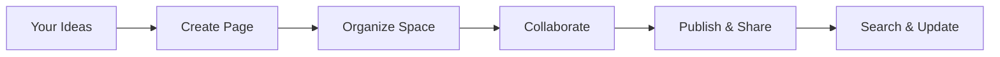

## Overview

DAB Worx provides a centralized platform where you create, organize, and manage all your project documentation. You build custom documentation spaces tailored to your teams, projects, or products, with features like version control, search, and collaboration tools. Streamline your workflow by turning scattered notes into structured, searchable knowledge bases.

## Key Benefits

DAB Worx simplifies documentation management with powerful features designed for teams of all sizes.

<Columns cols={3}>
  <Card title="Centralized Spaces" icon="database" href="#spaces">
    Create dedicated documentation spaces for each project. Organize pages hierarchically and collaborate in real-time.
  </Card>
  <Card title="Advanced Search" icon="search" href="#search">
    Find content instantly with full-text search, tags, and filters. No more digging through folders.
  </Card>
  <Card title="Version History" icon="git-branch" href="#versions">
    Track changes with full version history. Roll back edits and maintain audit trails effortlessly.
  </Card>
</Columns>

## Quick Start

Get up and running with DAB Worx in minutes.

<Steps>
  <Step title="Sign Up" icon="user-plus">
    Visit `https://app.dabworx.com` and create your free account. Verify your email to unlock full features.
  </Step>
  <Step title="Create a Space" icon="plus">
    Click **New Space** from the dashboard. Name it, add a description, and set permissions for your team.
  </Step>
  <Step title="Add Your First Page" icon="file-text">
    Inside your space, create a new page. Use the MDX editor to add content, code blocks, and components.
  </Step>
  <Step title="Publish and Share" icon="share-2">
    Publish your space and share the public link. Invite collaborators via email or Slack integration.
  </Step>
</Steps>

<Callout kind="tip">
  Pro tip: Start with our templates for API docs, onboarding guides, or changelogs to accelerate setup.
</Callout>

## Example: Embedding Code Snippets

Showcase technical content with syntax-highlighted code blocks across languages.

<CodeGroup tabs="JavaScript,Python">
  ```javascript
  // Fetch documentation from DAB Worx API
  const response = await fetch('https://api.dabworx.com/v1/spaces/{spaceId}/pages', {
    headers: {
      'Authorization': `Bearer ${YOUR_API_KEY}`
    }
  });
  const pages = await response.json();
  console.log(pages);
  ```
  ```python
  # Fetch documentation from DAB Worx API
  import requests

  headers = {'Authorization': f'Bearer {YOUR_API_KEY}'}
  response = requests.get('https://api.dabworx.com/v1/spaces/{spaceId}/pages', headers=headers)
  pages = response.json()
  print(pages)
  ```
</CodeGroup>

## Next Steps

Dive deeper into DAB Worx with these guides.

<Columns cols={2}>
  <Card title="Quickstart Guide" icon="zap" href="/quickstart">
    Set up your first full documentation workflow.
  </Card>
  <Card title="Authentication" icon="lock" href="/authentication">
    Secure your spaces with API keys and OAuth.
  </Card>
  <Card title="Configuration" icon="settings" href="/configuration">
    Customize editors, themes, and integrations.
  </Card>
  <Card title="Changelog" icon="git-commit" href="/changelog">
    Stay updated with the latest releases.
  </Card>
</Columns>

<Expandable title="How DAB Worx Fits Your Workflow" default-open="false">



This simple flow shows how DAB Worx integrates into your daily documentation process.
</Expandable>